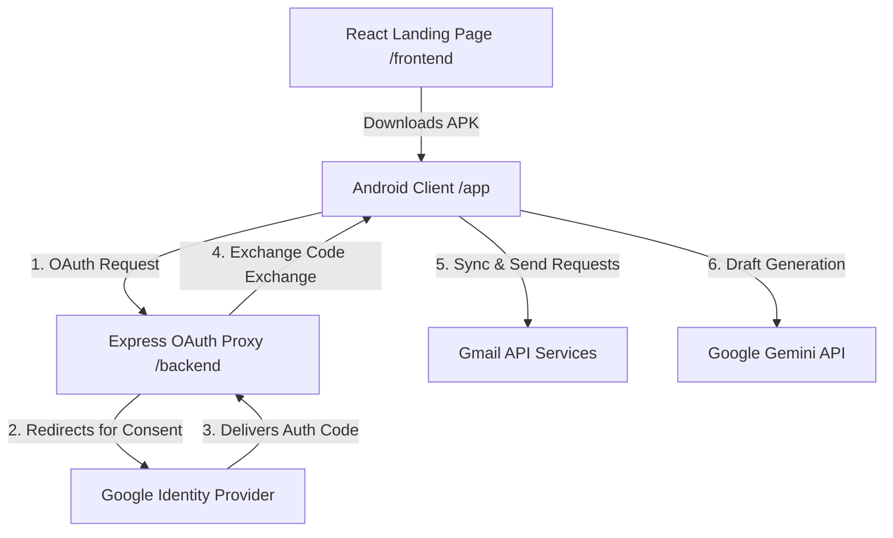

# GmailMNT — Secure AI-Powered Gmail Client

GmailMNT is a secure, modern, and high-performance Android email client integrated with a Node.js OAuth proxy backend and a React-based landing page. The application features a premium dark-mode design system, incremental synchronization (Gmail History API), an offline send outbox queue (Room DB + WorkManager), strictly enforced biometric security, and a Gemini AI-powered email composition assistant.

---

## 🏗️ System Architecture

The GmailMNT ecosystem is split into three core components:



1. **Android Client (`/app`)**: Built with Kotlin following modern Android architecture guidelines (MVVM, Jetpack Compose/XML, Room, WorkManager, Coroutines).
2. **OAuth Proxy Backend (`/backend`)**: A lightweight Node.js Express server that orchestrates secure OAuth 2.0 flows, session state validation (CSRF protection), and token refresh proxying.
3. **Landing Page (`/frontend`)**: A high-fidelity, responsive marketing site built using Vite, React, Framer Motion, and custom CSS variables.

---

## 🚀 Key Technical Features

### 1. Incremental Sync (Gmail History API)
* **API Efficiency:** Utilizes `users.history.list` to fetch only changes (new/deleted messages, modifications of stars or labels) since the last synchronized state instead of pulling the entire mailbox.
* **Preserving Quota:** Optimizes API consumption under tight Google Cloud limits.
* **Expired State Handlers:** Automatically detects expired or invalidated Google History IDs (HTTP 404/410) and triggers a clean, incremental mailbox refresh.

### 2. Offline Outbox Queue (Room DB + WorkManager)
* **Offline Composition:** Users can compose and send messages offline. Emails are queued locally in a secure SQLite Room database outbox.
* **Background Worker:** A Jetpack `WorkManager` background task (`SendEmailWorker`) runs with a `CONNECTED` network constraint. Once internet access is restored, queued emails are immediately pushed to Gmail in the background.

### 3. Strictly Enforced Biometric Security
* **Access Control:** Protects user emails by locking the app behind fingerprint or facial biometric verification on launch.
* **On/Off Toggle:** Disabled by default on clean installations for a frictionless onboard, and can be activated or deactivated within the in-app settings screen.
* **Hard-Lock startup:** When toggled on, canceling the prompt blocks all access. The user must click **"Unlock App"** to retry.

### 4. Gemini AI Email Composer & Reply Generator
* **AI Integration:** Allows users to compose formal, casual, or custom responses using contextual prompt prompts.
* **Cascading Fallbacks:** Resilience against rate limiting and server throttling. If the primary model API fails or returns HTTP 503, the client automatically cascades through secondary model configurations (e.g., Gemini 2.5 Flash fallback chain) to secure a successful draft.

### 5. Secure OAuth 2.0 Flow
* **Security Validation:** Prevents deep link interception by using short-lived exchange codes and random state variables stored dynamically on the backend proxy server to prevent CSRF attacks.

---

## 📂 Project Structure

```text
GmailMnT/
├── app/                  # Android Client (Kotlin, Jetpack, Room, WorkManager)
│   └── src/
│       └── main/
│           └── java/com/example/
│               ├── data/ # Repositories & Local Database (Room)
│               └── ui/   # ViewModels & UI Layout Screens
├── backend/              # Express Node.js Server (Google OAuth Proxy)
│   ├── index.js          # Route controllers (Auth, Callback, Exchange, Refresh)
│   └── package.json
├── frontend/             # Landing Page (Vite, React, Framer Motion, CSS)
│   ├── src/
│   │   ├── LandingPage.jsx
│   │   └── index.css
│   └── package.json
└── README.md             # Project Main Documentation
```

---

## 🛠️ Build & Installation Guide

### 1. Android Application (`/app`)

#### Prerequisites
* **Android Studio** (Koala | 2024.1.1 or later)
* Android SDK Platform 34+
* JDK 17+

#### Configuration
1. Open the project folder in Android Studio.
2. In your Android configuration, configure your Gemini API Key and Render Backend URL. Create a `.env` or local configuration properties mapping the following keys:
   ```env
   GEMINI_API_KEY=your_google_gemini_api_key
   RENDER_BACKEND_URL=https://your-custom-backend.onrender.com
   ```
3. Generate a debug/release build:
   ```bash
   ./gradlew assembleDebug
   ```

---

### 2. OAuth Proxy Backend (`/backend`)

The backend functions as an Express proxy server to handle authentication with Google API.

#### Setup & Run
1. Navigate to the backend directory:
   ```bash
   cd backend
   ```
2. Install npm dependencies:
   ```bash
   npm install
   ```
3. Create a `.env` file in the `/backend` folder:
   ```env
   PORT=3000
   GOOGLE_CLIENT_ID=your_google_client_id.apps.googleusercontent.com
   GOOGLE_CLIENT_SECRET=your_google_client_secret
   GOOGLE_REDIRECT_URI=http://localhost:3000/callback
   ```
4. Start the server:
   ```bash
   npm start
   ```

---

### 3. Marketing Landing Page (`/frontend`)

The landing page provides direct APK downloads and guides visitors through Google OAuth Whitelisting setup.

#### Setup & Run
1. Navigate to the frontend directory:
   ```bash
   cd frontend
   ```
2. Install dependencies:
   ```bash
   npm install
   ```
3. Run the Vite development server locally:
   ```bash
   npm run dev
   ```
4. Build the static production bundle:
   ```bash
   npm run build
   ```

---

## ⚠️ Important sandbox Mode Notice

Since the Google OAuth Cloud project status is set to **"Testing"**, only whitelisted accounts can sign in. Unregistered users will encounter a Google block screen.
* **Prerequisite:** Visitors must submit their Gmail address via the whitelist request action on the landing page (directed to `rupambairagya08@gmail.com`) before they can authorize access.
* **Manual Access Fallback:** Users on desktop interfaces without default local mail clients can copy the whitelisting address using the clipboard copy button directly on the website banner.

---

## 🔒 Security Policy

* **No Server Data Retention:** The backend operates as a stateless authentication helper. Access tokens, refresh tokens, profile info, and local email databases are stored strictly on-device in secure SQLite Room database sandboxes.
* **Biometric Locks:** Passcodes/auth keys are handled directly via Android Cryptographic Keystore and Keystore Providers.
